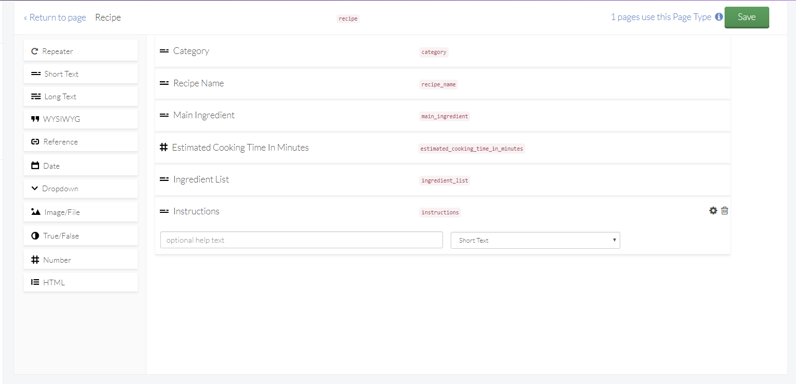

# buttercms-java

Java Library for ButterCMS API. 

## Documentation

For a comprehensive list of examples, check out the [API documentation](https://buttercms.com/docs/api/).


## Installation

### Maven

**pom.xml**
```
<dependencies>
...
    <dependency>
      <groupId>com.buttercms</groupId>
      <artifactId>buttercmsclient</artifactId>
      <version>1.6</version>
    </dependency>
...
</dependencies>    
```

### Gradle

**build.gradle**
```
dependencies {
    implementation 'com.buttercms:buttercmsclient:1.6'
}
```


## Usage

To get started with the Butter API, instantiate the ButterCMSClient with the API key found in the [Butter Admin Settings](https://buttercms.com/settings/). An optional timeout parameter can be passed as a [TimeSpan](https://msdn.microsoft.com/en-us/library/system.timespan%28v=vs.110%29.aspx); the default is 10 seconds.

```java
import com.buttercms.IButterCMSClient;
import com.buttercms.ButterCMSClient;
...
IButterCMSClient client = new ButterCMSClient("your_api_token");
```

If the application will be making many Butter API calls, it is recommended to store and re-use the client object.

Given client is based on [Apache HttpComponents](https://hc.apache.org/) - meaning, in case you need more custom setting for `HttpClient` you can pass one in to constructor:
```java
import com.buttercms.IButterCMSClient;
import com.buttercms.ButterCMSClient;
import org.apache.http.client.HttpClient;
...
HttpClient you_http_client = HttpClients.custom()
                               .addInterceptorFirst(you_interceptor)
                               .setDefaultHeaders(you_headers)
                               .build()
IButterCMSClient client = new ButterCMSClient("your_api_token", you_http_client);
```

## Sections

* [Posts](#posts)
* [Authors](#authors)
* [Categories](#categories)
* [Feeds](#feeds)
* [Collections](#collections)
* [Pages](#pages)
* [Class Definitions](#class-definitions)
* [Exceptions](#exceptions)

## Posts

### Get Posts

Listing posts returns a [PostsResponse](#postsresponse-class) object. This object consists of a [PaginationMeta](#paginationmeta-class) object and List&lt;[Post](#post-class)&gt;

#### getPosts() parameters
| Parameter|Description|
| ---|---|
| queryParams  | Map of additional Query Parameters|

#### getPosts() Query Parameters

| Query Parameter|Default|Description|
| ---|---|---|
| page(optional) | 1 | Used to paginate through older posts. |
| page_size(optional) | 10 |  Used to set the number of blog posts shown per page. |
| exclude_body(optional) | false | When true, does not return the full post body. Useful for keeping response size down when showing a list of blog posts. |
|author_slug(optional) | |Filter posts by an author’s slug.|
|category_slug(optional) | | Filter posts by a category’s slug.
| query |  | Search query |

#### Examples

```java
Map<String,String> queryParams = new HashMap<String,String>(){{
    add("exclude_body","true");
    ...
}}
PostsResponse posts = butterClient.getPosts(queryParams);
```

### Retrieving a Single Post

Retrieving a single Post will return a PostResponse object. This object consists of a single [Post](#post-class) and [PostMetadata](#postmeta-class). Post Metadata offers hints about the Previous and Next posts.

#### getPost() Parameters

| Parameter|Description|
| ---|---|
| slug|The slug of the post to be retrieved.|

#### Examples

```java
PostResponse controversialPost = butterClient.getPost("tabs-vs-spaces-throwdown");
```


## Authors

### List Authors

Listing posts returns a [AuthorsResponse](#authorsresponse-class) object. This object consists of a List&lt;[Author](#author-class)&gt;

#### getAuthors() Parameters
| Parameter|Description|
| ---|---|
| queryParams | Map of additional Query Parameters|

#### getAuthors() Query Parameters
| Query Parameter|Description|
| ---|---|
| include |If value is `recent_posts`, will return the author's recent posts in the response|

#### Examples

```java
Map<String,String> queryParams = new HashMap<String,String>(){{
    add("include","recent_posts");
    ...
}}
AuthorsResponse authors = butterClient.getAuthors(queryParams);
```

### Retrieve a Single Author

Retrieving an author returns an [AuthorResponse](#authorresponse-class) object. This object consists of single [Author](#author-class) if found

#### getAuthor() Parameters

| Parameter|Description|
| ---|---|
|slug|The slug of the author to be retrieved.|
| queryParams | Map of additional Query Parameters|

#### getAuthor() QueryParameters
| Query Parameter|Description|
| ---|---|
| include |If value is `recent_posts`, will return the author's recent posts in the response|

#### Examples

```java
Map<String,String> queryParams = new HashMap<String,String>(){{
    add("include","recent_posts");
    ...
}}
AuthorResponse authors = butterClient.getAuthor("john",queryParams);
```

## Categories

### List Categories

Listing Categories returns a [CategoriesResponse](#categoriesresponse-class) object. This object consists of a List&lt;[Category](#Category-class)&gt;

#### getCategories() Parameters
| Parameter|Description|
| ---|---|
| queryParams | Map of additional Query Parameters|

#### getCategories() Parameters

| Query Parameter|Description|
| ---|---|
| include |If value is `recent_posts`,  will return recent posts along with categories|

#### Examples

```java
Map<String,String> queryParams = new HashMap<String,String>(){{
    add("include","recent_posts");
    ...
}}
CategoriesResponse getCategories = butterClient.getCategories(queryParams);
```

### Retrieve a Single Category

Retrieving an author returns an [CategoryResponse](#categoryresponse-class) object. This object consists of single [Category](#category-class) if found

#### getCategory() Parameters

| Parameter|Description|
| ---|---|
|slug|The slug of the category to be retrieved.|
| queryParams | Map of additional Query Parameters|


| Parameter|Description|
| ---|---|
| include |If value is `recent_posts`,  will return recent posts along with categories|

#### Examples

```java
Map<String,String> queryParams = new HashMap<String,String>(){{
    add("include","recent_posts");
    ...
}}
CategoryResponse getCategories = butterClient.getCategory("java",queryParams);
```

## Feeds

Each of the feeds methods returns an [Document](https://docs.oracle.com/javase/7/docs/api/org/w3c/dom/Document.html).


### RSS Feed

Retrieve a fully generated RSS feed for your blog.

#### Examples

```java
 Document rssFeed = butterClient.getRSS();
```

### Atom Feed

Retrieve a fully generated Atom feed for your blog.

#### Examples

```java
 Document atomFeed = butterClient.getAtom();
```

### Sitemap

Retrieve a fully generated sitemap for your blog.

#### Examples

```java
 XmlDocument siteMap = butterClient.getSiteMap();
```

## Collections

### List collection items
Listing collection items returns a [CollectionResponse&lt;T&gt;](#collectionresponse-class) object. This object consists of a [PaginationMeta](#pagination-meta) object and [Collection&lt;T&gt;](#collection-class);
#### getCollection() Parameters

| Parameter|Description|
| ---|---|
|collectionSlug| Collection key|
| queryParams | Map of additional Query Parameters|
| classType | Class that collection will be deserialized in to|

#### getCollection() Query Parameters

|Query Parameter|Description|
| ---|---|
|test (optional)| Set to 1 to enable Preview mode for viewing draft content.|
| fields.key (optional) | Optional param. Filter the result set by the field and value.|
| order (optional)| Order the result set by this field. Defaults to Ascending. Preprend ’-’ to sort Descending. i.e. order=-date_published|
| page (optional)| Used for Paginating through result set.|
| page_size (optional)| Used for Paginating. Defines the number of results returned.|
| locale (optional)| Set to the api slug of your configured locale (i.e. en or fr)|
| levels (optional)| Defaults to 2. Defines the levels of relationships to serialize.|

#### Examples

```java
CollectionResponse response = client.getCollection("cars", new HashMap<String, String>() {{
            put("fields.weight", "400");
            put("page_size", "1");
    }}, Car.class);
```

## Pages

### List Pages

Listing Pages returns a [PagesResponse&lt;T&gt;](#pagesresponse-class) object. This object consists of a [PaginationMeta](#pagination-meta) object and List&lt;T&gt;

#### ListPages() Parameters

| Parameter|Description|
| ---|---|
| queryParams | Map of additional Query Parameters|
| classType | Class that Page will be deserialized in to|

|Query Parameter|Description|
| ---|---|
|preview (optional)| Set to 1 to return the latest draft version of a page.|
| fields.key (optional) | Optional param. Filter the result set by the field and value.|
| order (optional)| Order the result set by this field. Defaults to Ascending. Preprend ’-’ to sort Descending. i.e. order=-date_published|
| page (optional)| Used for Paginating through result set.|
| page_size (optional)| Used for Paginating. Defines the number of results returned.|
| locale (optional)| Set to the api slug of your configured locale (i.e. en or fr)|
| levels (optional)| Defaults to 2. Defines the levels of relationships to serialize.|

#### Examples

```java
PagesResponse<RecipePage> response = client.getPages("recipe", new HashMap<String, String>() {{
            put("page_size", "1");
    }}, RecipePage.class)
```

### Retrieve a Single Page

Retrieving a single page returns a [PageResponse&lt;T&gt;](#pageresponse-class) object

#### getPage() Parameters

| Parameter|Description|
| ---|---|
|pageType| Desired page type|
|pageSlug| Slug of the desired page|
| queryParams | Map of additional Query Parameters|
| classType | Class that Page will be deserialized in to|

|Query Parameter|Description|
| ---|---|
|preview (optional)| Set to 1 to return the latest draft version of a page.|
|locale (optional)| Set to the api slug of your configured locale (i.e. en or fr)|

#### Examples

```java
   PageResponse<RecipePage> recipe = client.getPage("recipe", "recipe-page-11", new HashMap<String, String>() {{
            put("preview", "1");
    }}, RecipePage.class);
```

##### Page Type Definition in the Butter Admin



## Class Definitions

### PostsResponse Class

| Property | Type|
|----|---|
|meta| [PaginationMeta](#paginationmeta-class)|
|data| List&lt;[Post](#post-class)&gt;|

### Post Class

| Property | Type|
|----|---|
|url|String|
|created|Date|
|published|Date|
|Author|[Author](#author-class)|
|Categories|List&lt;[Category](#category-class)&gt;|
|slug|String|
|title|String|
|body|String|
|summary|String|
|seoTitle|String|
|metaDescription|String|
|featuredImage|String|
|Status|[Status](#status-enum)|

### Status enum

|Constant|Value|
|---|---|
|Draft|1|
|Published|2|

### PostResponse Class

| Property | Type|
|----|---|
|Meta|[PostMeta](#postmeta-class)|
|Data|[Post](#post-class)|

### PostMeta Class

| Property | Type|
|----|---|
|nextPost|[PostSummary](#postsummary-class)|
|previousPost|[PostSummary](#postsummary-class)|

### PostSummary Class

| Property | Type|
|----|---|
|slug|string|
|title|string|
|featuredImage|string|

### AuthorsResponse class
| Property | Type|
|----|---|
|data| List&lt;[Author](#author-class)&gt;|


### AuthorResponse class
| Property | Type|
|----|---|
|data| [Author](#author-class)|

### Author Class

| Property | Type|
|----|---|
|firstName| string|
|lastName| string|
|email| string|
|slug| string|
|bio| string|
|title| string|
|linkedinUrl| string|
|facebookUrl| string|
|instagramUrl| string|
|pinterestUrl| string|
|twitterHandle| string|
|profileImage| string|
|recentPosts| List&lt;[Post](#post-class)&gt;|


### CategoriesResponse class
| Property | Type|
|----|---|
|data| List&lt;[Category](#author-class)&gt;|


### CategoryResponse class
| Property | Type|
|----|---|
|data| [Category](#author-class)|

### Category Class

| Property | Type|
|----|---|
|name| string|
|slug| string|
|recentPosts| IEnumerable&lt;[Post](#post-class)&gt;|


### CollectionResponse class
| Property | Type|
|----|---|
|data| [Collection&lt;T&gt;](#collection-class)|
|meta| [PaginationMeta](#paginationmeta-class)|

### Collection class
| Property | Type|
|----|---|
|items| List&lt;T&gt;|

### PagesResponse Class

| Property | Type|
|----|---|
|meta| [PageMeta](#pagemeta-class)|
|data| List&lt;[Page](#page-class)&lt;T&gt;&gt;|

### PaginationMeta Class

| Property | Type|
|----|---|
|count| int|
|previousPage| int|
|nextPage| int|

### PageResponse Class

| Property | Type|
|----|---|
|data| [Page](#page-class)&lt;T&gt;|

### Page Class

| Property | Type|
|----|---|
|slug| string|
|fields|T|

## Exceptions

### ButterCMSResponseException

General RunTime exception that wraps API error responses 
